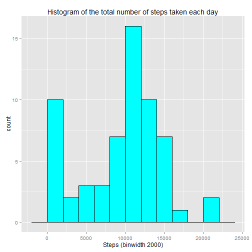
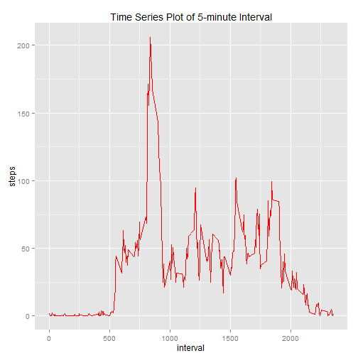
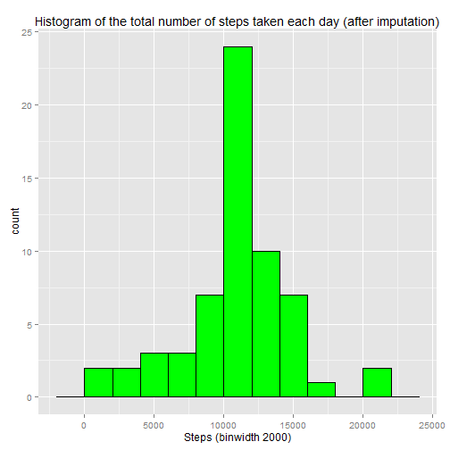
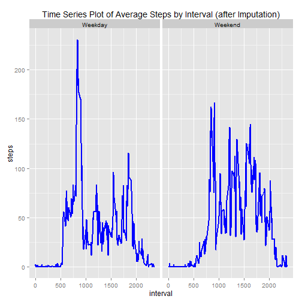

# Reproducible Research: Peer Assessment 1

## Loading and preprocessing the data

```r
library(ggplot2)
library(knitr)
# download the data from coursera page (activity.zip)
# unzip the file (activity.csv)
# make sure you are in the right working directory
#Load the data (i.e. read.csv())
MyData <- read.csv("./activity.csv")
str(MyData)
```

```
## 'data.frame':	17568 obs. of  3 variables:
##  $ steps   : int  NA NA NA NA NA NA NA NA NA NA ...
##  $ date    : Factor w/ 61 levels "2012-10-01","2012-10-02",..: 1 1 1 1 1 1 1 1 1 1 ...
##  $ interval: int  0 5 10 15 20 25 30 35 40 45 ...
```

```r
head(MyData)
```

```
##   steps       date interval
## 1    NA 2012-10-01        0
## 2    NA 2012-10-01        5
## 3    NA 2012-10-01       10
## 4    NA 2012-10-01       15
## 5    NA 2012-10-01       20
## 6    NA 2012-10-01       25
```

```r
#Process/transform the data (if necessary) into a format suitable for your analysis
# converts to date format
MyData$date <- as.Date(MyData$date, "%Y-%m-%d")
```

## What is mean total number of steps taken per day?

```r
StepsByDay <- aggregate(x = MyData$steps , by = list(MyData$date), FUN = sum ,na.rm=TRUE)
head(StepsByDay)
```

```
##      Group.1     x
## 1 2012-10-01     0
## 2 2012-10-02   126
## 3 2012-10-03 11352
## 4 2012-10-04 12116
## 5 2012-10-05 13294
## 6 2012-10-06 15420
```

```r
names(StepsByDay) <- c("date","steps")


hist_plot <- ggplot(StepsByDay,aes(x = steps)) +
  ggtitle("Histogram of the total number of steps taken each day") +
  xlab("Steps (binwidth 2000)") +
  geom_histogram(binwidth = 2000, color="black", fill="cyan")
hist_plot
```

 

```r
#mean total number of steps taken per day
mean(StepsByDay$steps , na.rm = TRUE)
```

```
## [1] 9354.23
```

```r
#median total number of steps taken per day
median(StepsByDay$steps , na.rm = TRUE)
```

```
## [1] 10395
```


```
## [1] 9354.23
```

```
## [1] 10395
```
Mean total number of steps taken per day is 9354.2295082 <br>
Median total number of steps taken per day is 10395

## What is the average daily activity pattern?

```r
#Time series plot of 5-minute interval and the average number of steps taken, averaged across all days
AvgStepsByInterval <- aggregate(x=MyData$steps, by=list(MyData$interval), FUN=mean, na.rm=TRUE)
head(AvgStepsByInterval)
```

```
##   Group.1         x
## 1       0 1.7169811
## 2       5 0.3396226
## 3      10 0.1320755
## 4      15 0.1509434
## 5      20 0.0754717
## 6      25 2.0943396
```

```r
names(AvgStepsByInterval) <- c("interval", "steps")

AvgStepLine <- ggplot(AvgStepsByInterval,aes(interval,steps)) +
  ggtitle("Time Series Plot of 5-minute Interval") +
  geom_line(color="red")
AvgStepLine  
```

 


```r
#The 5-min time interval contains the maximum number of steps?
AvgStepsByInterval[which.max(AvgStepsByInterval$steps),c("interval")]
```

```
## [1] 835
```


The 5-min time interval contains the maximum number of steps is 835

## Imputing missing values

```r
# calculate and report the total number of missing values in the dataset (i.e. the total number of rows with NAs)
#total number of missing values in the dataset
nrow(MyData[is.na(MyData$steps),])
```

```
## [1] 2304
```

```r
# devise a strategy for filling in all of the missing values in the dataset. The strategy does not need to be sophisticated.  For example, you could use the mean/median for that day, or the mean for that 5-minute interval, etc.
#Strategy: imputing missing step values with mean step for the 5-minute interval
MyData.imputed <- merge(x = MyData, y = AvgStepsByInterval, by = "interval", all.x = TRUE)
head(MyData.imputed)
```

```
##   interval steps.x       date  steps.y
## 1        0      NA 2012-10-01 1.716981
## 2        0       0 2012-11-23 1.716981
## 3        0       0 2012-10-28 1.716981
## 4        0       0 2012-11-06 1.716981
## 5        0       0 2012-11-24 1.716981
## 6        0       0 2012-11-15 1.716981
```

```r
MyData.imputed[is.na(MyData.imputed$steps.x),c("steps.x")] <- MyData.imputed[is.na(MyData.imputed$steps.x),c("steps.y")]
head(MyData.imputed)
```

```
##   interval  steps.x       date  steps.y
## 1        0 1.716981 2012-10-01 1.716981
## 2        0 0.000000 2012-11-23 1.716981
## 3        0 0.000000 2012-10-28 1.716981
## 4        0 0.000000 2012-11-06 1.716981
## 5        0 0.000000 2012-11-24 1.716981
## 6        0 0.000000 2012-11-15 1.716981
```

```r
# Crete a new dataset that is equal to the original dataset but with the missing data filled in.
MyData.imputed$date <- as.Date(MyData.imputed$date)
MyData.imputed$date.x <- NULL
MyData.imputed$Group.1 <- NULL
MyData.imputed$steps <- MyData.imputed$steps.x
MyData.imputed$steps.x <- NULL
MyData.imputed$steps.y <- NULL
head(MyData.imputed)
```

```
##   interval       date    steps
## 1        0 2012-10-01 1.716981
## 2        0 2012-11-23 0.000000
## 3        0 2012-10-28 0.000000
## 4        0 2012-11-06 0.000000
## 5        0 2012-11-24 0.000000
## 6        0 2012-11-15 0.000000
```

```r
# Make a histogram of the total number of steps taken each day and calculate and report the mean and median total number of steps taken per day.  Do these values differ from the estimates from the first part of the assignment?  What is the impact of imputing missing data on the estimates of the total daily number of steps?

#histogram with new dataframe
StepsByDay <- aggregate(x = MyData.imputed$steps , by = list(MyData.imputed$date), FUN = sum ,na.rm=TRUE)
names(StepsByDay) <- c("date","steps")
histplot <- ggplot(StepsByDay,aes(x = steps)) +
  ggtitle("Histogram of the total number of steps taken each day (after imputation)") +
  xlab("Steps (binwidth 2000)") +
  geom_histogram(binwidth = 2000, color="black", fill="green")
histplot
```

 


```r
#mean total number of steps taken per day
mean(StepsByDay$steps , na.rm = TRUE)
```

```
## [1] 10766.19
```

```r
#median total number of steps taken per day
median(StepsByDay$steps , na.rm = TRUE)
```

```
## [1] 10766.19
```


New mean total number of steps taken per day is 1.0766189 &times; 10<sup>4</sup>  <br>
New median total number of steps taken per day is 1.0766189 &times; 10<sup>4</sup>

## Are there differences in activity patterns between weekdays and weekends?

```r
#Factor variable with two levels indicating a weekday or weekend.
MyData.imputed$weekday <- as.factor(ifelse(weekdays(MyData.imputed$date) %in% c("Saturday","Sunday"), "Weekend", "Weekday")) 

AvgStepsByInterval.weekday  <- aggregate(x = MyData.imputed$steps, by = list(MyData.imputed$interval,MyData.imputed$weekday), FUN = mean ,na.rm=TRUE)
names(AvgStepsByInterval.weekday) <- c("interval","weekday","steps")
names(AvgStepsByInterval.weekday)
```

```
## [1] "interval" "weekday"  "steps"
```

```r
#panel time series plot of the 5-minute interval and the average number of steps taken 
#averaged across all weekday days or weekend days.
AverageStep <- ggplot(AvgStepsByInterval.weekday,aes(interval,steps)) +
  ggtitle("Time Series Plot of Average Steps by Interval (after Imputation)") +
  facet_grid(. ~ weekday) +
  geom_line(size = 1, color="blue")
AverageStep  
```

 

